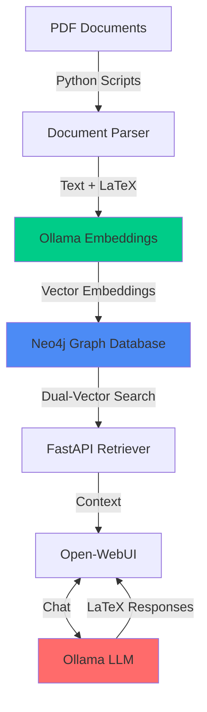

## Overview

This system provides a complete local AI infrastructure for Retrieval-Augmented Generation (RAG) with specialized support for scientific and mathematical documents containing LaTeX notation.

### Architecture

### How It Works

1. **Document Ingestion**: PDF documents are processed to extract both prose text and LaTeX mathematical notation separately
2. **Dual Embedding**: Each chunk generates two embeddings via Ollama's bge-m3 model:
   - `vec_text`: Embedding of prose content
   - `vec_latex`: Embedding of mathematical/LaTeX content
3. **Graph Storage**: Neo4j stores documents, sections, and chunks with vector indexes for similarity search
4. **Retrieval**: FastAPI service queries both vector indexes and fuses results for comprehensive context
5. **Generation**: Open-WebUI interfaces with Ollama (mistral:7b) to generate LaTeX-formatted responses
6. **Chat Interface**: Users interact through a web UI with proper LaTeX rendering

### Key Components

- **Neo4j**: Graph database with vector search capabilities
- **Ollama**: Local embedding (bge-m3) and LLM (mistral:7b) service
- **Python RAG Scripts**: Document processing and ingestion pipeline
- **FastAPI**: REST API for retrieval operations
- **Open-WebUI**: Browser-based chat interface with LaTeX support
- **Podman**: Container runtime for Open-WebUI

